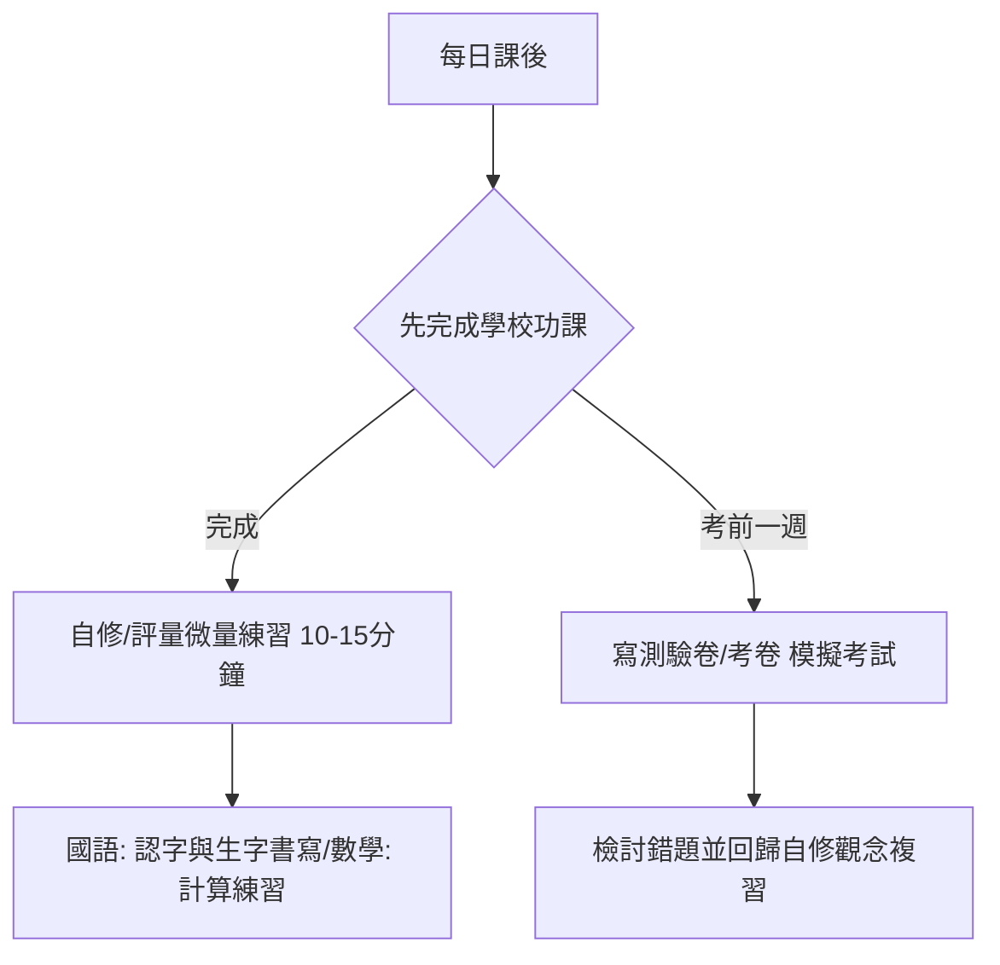

# 邱御恩的 115 學年度二年級（小一升小二）重點科目學習教材推薦與規劃

本規劃報告依據 **桃園市潮音國民小學 115 學年度教科書選用版本** 以及 **Gooro 夠了參考書店** 的教材選購指南，針對國語、數學、生活等重點科目進行教材推薦。

---

## 1. 學校選用教科書版本確認

經查詢 [潮音國民小學 115 學年度教科書選用版本一覽表.pdf](file:///d:/Google%20雲端硬碟-janchen.chiou/潮音國小/潮音國民小學%20115%20學年度教科書選用版本.pdf)，二年級的重點學科版本如下：

| 學科 | 115 學年度選用版本 | 備註 |
| :--- | :--- | :--- |
| **國語** | **康軒版** | 語文領域核心 |
| **數學** | **翰林版** | 數理思維核心 |
| **生活** | **南一版** | 結合藝術、社會與自然之低年級跨領域科目 |

> [!IMPORTANT]  
> 購買任何自修、評量、測驗卷時，**務必選擇與上述學校教科書對應的版本**（國語選「康軒」、數學選「翰林」、生活選「南一」），才能與學校的教學進度完全對齊。

---

## 2. 教材種類解析與選購建議 (參考 Gooro 指南)

依據 [Gooro 夠了參考書店教材顧問建議](https://gooro.vip/)，國小低年級的輔材可依學習目的分類，建議家長**「重質不重量」**，依孩子學習狀況挑選：

### A. 自修（適合：觀念預習、家長指導、深度學習）
*   **功能**：重點整理最詳細，內含課文詳細注釋、生字筆順、課後習題解答。
*   **建議**：若家長需要輔導孩子，或希望孩子能預習課文，建議可購入**「國語自修」**與**「數學自修」**。

### B. 評量 / 講義式評量（適合：日常練習、實力檢測）
*   **功能**：題型偏向基礎與中難度，按課本單元設計，適合每週或每單元結束後練習。
*   **建議**：這是最核心的日常練習本，建議**國語、數學、生活皆可各備一本評量**，作為課後寫完學校作業後的自我檢測。

### C. 測驗卷 / 考卷（適合：考前衝刺、限時模擬）
*   **功能**：採用整張雙面考卷格式（如同學校段考試卷），主要用於考前一至兩週，讓孩子適應考試節奏與時間分配。
*   **建議**：若學校考試頻率較高或孩子容易緊張，可準備**國語、數學的測驗卷**，在段考前一週當作模擬考使用。

---

## 3. 重點科目教材推薦清單 (Gooro.vip 管道)

家長可在 [Gooro 國小輔材專區](https://gooro.vip/) 或實體參考書店直接依照以下規格選購：

### 📘 國語（學校版本：康軒）
*   **推薦組合一：穩紮穩打型**
    *   **自修**：《康軒國語自修 2上》── 用於生字造詞、筆順及成語補充。
    *   **評量**：《康軒國語評量 2上》或《康軒國語講義式評量 2上》── 週練與課後複習。
*   **推薦組合二：考前衝刺型**
    *   **測驗卷**：《康軒國語測驗卷 2上》── 考前模擬。
*   **額外推薦（素養延伸）**：
    *   《康軒跟著閱讀來識字｜國小低年級》[Gooro 商品連結](https://gooro.vip/)：由讀寫專家設計，適合小二學生在故事中擴展字彙量與閱讀理解力。

### 📙 數學（學校版本：翰林）
*   **推薦組合：**
    *   **自修**：《翰林數學自修 2上》── 內含課本概念與解題圖解，適合家長引導解題。
    *   **評量**：《翰林數學評量 2上》── 單元練習，小二數學開始接觸乘法（九九乘法表）與二位數加減，需要充足的練習。
    *   **計算練習（選購）**：《翰林數學計算高手 2上》── 若孩子計算速度較慢，可加強純計算練習。

### 綠色 生活（學校版本：南一）
*   **推薦組合：**
    *   **評量**：《南一生活評量 2上》── 生活課程內容較為活潑、廣泛，一般不需要買到自修，準備一本評量於課後或考前練習即可。

---

## 4. 學習時間與教材搭配規劃

為避免孩子過度刷題造成學習倦怠，建議採取以下教材搭配：

*   **平時週一至週五**：
    *   主要以學校課本、習作和作業為主。
    *   若學校進度完成，可使用**評量**練習 1~2 頁（約 15 分鐘），保持手感。
*   **週末**：
    *   若有不理解的觀念，使用**自修**進行觀念釐清與補充。
*   **段考前一週**：
    *   每天或隔天寫一張**測驗卷**，限時完成，練習考試時間掌控與寫名字、檢查的習慣。
